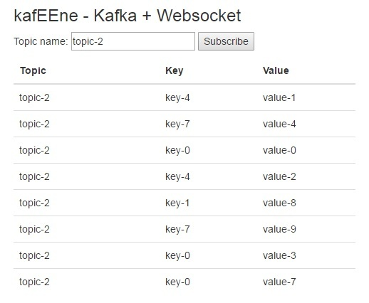

Check [the blog](https://abhirockzz.wordpress.com/2017/05/22/kafeene-1-websocket-kafka) for more details

## Start with Docker Compose

- `git clone https://github.com/abhirockzz/kafka-websocket.git`
- `cd dashboard` and `mvn clean install` - creates `kafka-websocket.war` in `target` directory
- `cd producer` and `mvn clean install` - creates `kafka-producer.jar` in `target` directory
- `cd ..` and `docker-compose up --build` - starts Kafka, Zookeeper, Payara and Producer containers (you can switch to any other [Java EE runtime](https://github.com/abhirockzz/kafka-websocket/blob/master/dashboard/Dockerfile#L1))
	- Kafka accessible @ `9092`
	- Zookeeper @ `2181`
	- Producer starts pushing records to Kafka topics (auto creates topic-1, topic-2)
	- Port `8080` exposed from Payara container

Wait for the containers to startup before you move to the testing part...

## Test

- `docker-machine ip` - get the IP address of your Docker host. Let's call it `APP_HOST`
- Open your browser and go to `http://<APP_HOST>:8080/kafka-websocket/`. Enter topic-1 or topic-2 in `subscription` input text box. You will start seeing the records being produced by the producer for that topic
	- You can open multiple such clients/browser windows/tabs and subscribe to either of these topics

- `docker-compose down -v` once you're done....
